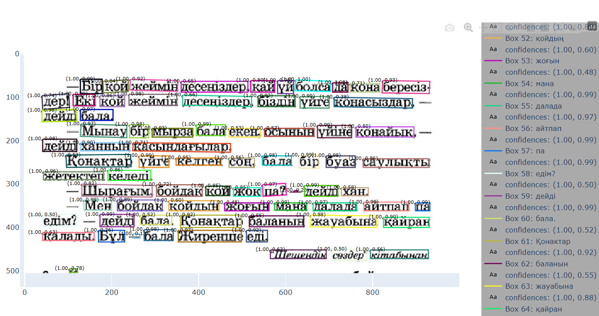

# Проект распознавания мультиязычных текстов OCR

## Описание проекта

Данный проект является сервисом для оцифровки текстовых документов по фотографии. Для работы сервиса использованы технологии `Pytorch Lightning` + `Hydra`, а в качестве моделей вариации детектор + рекогнайзер. Подробнее о моделях можно узнать в коде ядра и моделинга.
В качестве интерфейса взаимодействия предусмотрено API с сайтом на основе `Python FastAPI` + `JS React` или развёртывание на локальной машине.

## Входные данные

На вход системы в случаях работы с API и локальным запуском подаются изображения в форматах `.jpeg, .jpg, .png` или документы формата `.pdf`



Пример работы модели

## Выход модели

Выходом модели является изображение с локализацией текста и предсказаниями в отдельных bounding boxes. Также для проверки качества модели и отладки возвращаются и конфиденсы для детекции и распознавания отдельно.


## Структура репозитория

```bash
core
├── core                     <- Папка с ядром проекта, сервисом на API и инференсом
│
├── modeling_recognizer      <- Папка с моделингом Pytorch Lightning + Hydra для обучения моделей OCR
│
├── datasets                 <- Папка с датасетами, скриптами для них и файлами описания
│
├── weights                  <- Папка, где хранятся веса моделей
│
├── poetry.lock              <- Файл с фиксацией пакетов Poetry
│
├── CHANGELOG.md             <- Список изменений по коммитам и МР в репозиторий
│
├── pyproject.toml           <- Файл с описанием проекта и основными зависимостями
│
├── .pre-commit-config.yaml  <- Файлы пре-коммита и его
├── setup.cfg                <- настройки
│
└── README.md
```

## Установка окружения

Во всём репозитории используется единая среда на основе менеджера пакетов `poetry`.
Для установки окружения рекомендуем использовать `anaconda`.
Версии пакетов и python зафиксированы, универсальный способ установки:

```
conda create -n ocr-project python=3.10.16
conda activate ocr-project

pip install poetry=2.2.1
poetry install
```

Подробнее про зависимости модуля можно прочитать в файлах `pyproject.toml` и `poetry.lock`

## Запуск ядра

Перед началом запуска надо подтянуть веса

```
dvc get https://huggingface.co/NerfmanOriginal/ocr-diploma-models crnn_vgg16_lstm256_baseline__2025_10_08.pth -o /weights/
```

Теперь можно работать с нашим ядром

Для этого переходим в папку `/core`

Там инструкции и подробный пайплайн

## Запуск обучения

Для запуска обучения зайти в modeling_recognizer

Там подробно описаны все шаги в README
