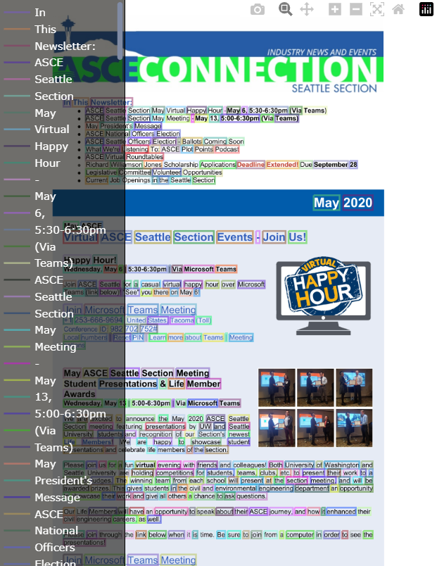

# Cкрипты для обработки датасетов

В папках по названиям собраны ноутбуки для обработки датасетов к одному виду

## Пример итогового изображения

## Требования

Проверялось на python 3.10 и 3.12

Все требования по версиям прописаны в requirements.txt

## Ссылки на датасеты

Ссылки на источники:

[PDFA](https://huggingface.co/datasets/pixparse/pdfa-eng-wds)

[DDI](https://github.com/machine-intelligence-laboratory/DDI-100/tree/master/dataset)

SROIE: [информация](https://huggingface.co/datasets/darentang/sroie) и [датасет](https://drive.google.com/file/d/1ZyxAw1d-9UvhgNLGRvsJK4gBCMf0VpGD/view)

## Формат входных и выходных данных

Каждый скрипт требует путь до датасета (__dataset_path__) и результирующую папку (__result_path__)

Результатом являются две папки - __data__ и __images__

Формат данных следующий - [DATASET_NAME]_[INDEX].(txt/png) для удобного ориентирования в том, из какого датасета изображение и дата

Данные в txt файле представлены в формате YOLO:

### text center_x center_y width height

## Результаты

Итоговый датасет в формате .7z файлов лежит на [shift-minio](https://console.shift-minio.yc.ftc.ru/browser/shift-recognition-symbols)
