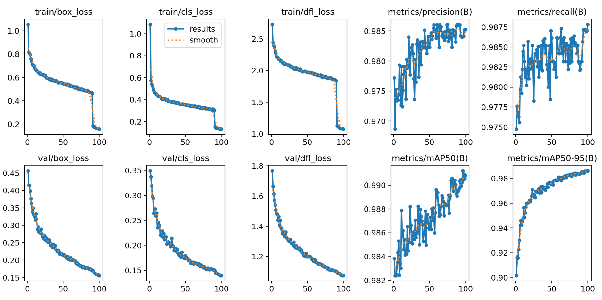

# Моделинг сегментации страниц

Данный проект предназначен для модели детекции страниц.

Детекция производится на основе модели YOLOv8m (oriented bounding boxes). Цель модели - найти страницу текста и построить ориентированный бокс, чтобы после этого методами аффинных преобразований преобразовать это в готовое фото выровненного документа.

## Использованные данные

Для обучения были собраны следующие наборы данных:

1. [document-segmentation-v2 (1 700 img)](https://universe.roboflow.com/lung-x8el1/document-segmentation-v2-gt86h/dataset/2)
2. [Document-Segmentation (5 000 img)](https://universe.roboflow.com/freddiews/document-segmentation-tzzh7/dataset/1)
3. [Document-Segmentation (3 200 img)](https://universe.roboflow.com/scanner-0doct/document-segmentation-duct0-k14ig/dataset/1)

Общий размер выборки составляет **10000 примеров**, содержащих 1+ страниц документов, ориентированных в пространстве.

## Обучение модели и результаты

Для запуска обучения необходимо достать данные, поместить их в данную директорию в папку `data`, сохранить в `data.yaml` только один класс `0: document`. Далее прогнать их через `convert_annots.ipynb` (для приведения аннотаций к одному виду) и запустить:

```
python train.py
```

Итогом обучения является готовая модель. Обучение проводилось на 100 эпохах, использованы стандартные гиперпараметры модели YOLOv8-obb.

### Метрики:

